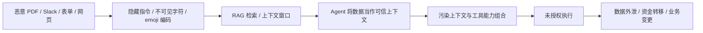

# 智能体安全风险图谱

## 1. 风险重心变化

这组 PPT 最重要的信号是：智能体安全已经从“模型回答是否有害”扩展到“Agent 是否能以安全、可控、可追责的方式代替人行动”。

传统 LLM 安全常关注：

- 越狱
- 有害内容输出
- 提示词注入
- 模型幻觉
- 内容合规

智能体安全新增或放大的风险：

- Agent 拥有工具权限、业务权限和文件/网络 IO。
- Agent 会跨系统执行多步计划。
- Agent 会读取不可信文档、网页、邮件、Slack、PDF、RAG 结果。
- Agent 会把上下文、记忆和工具输出混合成下一步行动依据。
- 多 Agent 会相互委托、协同、调用，导致责任链变长。
- 业务人员会绕过正式流程使用 Shadow AI，形成不可见攻击面。

因此，投毒仍然重要，但它只是入口之一。真正危险的是投毒内容进入数据路径后，与权限、自主性、工具链组合成“可执行后果”。

## 2. 六大企业挑战

现场材料给出的企业智能体安全六大挑战可以整理为：

| 挑战 | 风险本质 | 典型后果 |
|---|---|---|
| 权限扩张和越权 | 人、服务账号、Agent 身份边界混乱 | Agent 拿到不该有的系统/数据/资金权限 |
| 自主执行与多 Agent 协同 | 自动规划、委托、工具调用缺乏治理 | 行为不可解释、责任难界定、错误级联 |
| 敏感数据泄露 | 上下文、RAG、日志、工具输出混杂敏感信息 | PI/PII/代码/凭据外泄，数据主权受损 |
| 供应链安全 | 插件、MCP、模型、依赖、容器、反序列化不可信 | 不安全代码进生产，基础设施被打穿 |
| 提示词注入和诱导 | 外部内容影响 Agent 目标与行为 | 记忆污染、上下文污染、工具链污染 |
| 攻击面扩大 | Agent 把原本分散的系统连接起来 | 攻击者用自然语言放大跨系统攻击能力 |

## 3. 数据路径全链攻击

照片中的攻击链可以抽象为：



这个模型的关键不是“某个工具本身不合规”，而是：

- 数据来源不可信；
- Agent 把不可信数据当作指令或可信事实；
- 工具权限在单点看似合理；
- 多工具组合后形成高危能力；
- 审计只记录“Agent 做了什么”，但没有解释“为什么被污染”。

所以风险评估不能只看 CVSS 式的单漏洞严重度，而要把三类因素合并：

```text
风险 = 能力 × 自主性 × 权限 × 数据敏感度 × 可恢复性
```

现场提到应使用 AIVSS 取代传统 CVSS 打分，核心含义就是：智能体风险必须包含 Agent 行为能力和授权上下文。

## 4. Computer Use Agent 的特殊风险

Computer Use Agent 会以“用户本人”的视角看屏幕、点按钮、读网页、跨标签页操作。这会弱化许多 web 安全基础假设：

- 同源策略保护的是网页脚本，不一定保护代人操作的视觉 Agent。
- CSRF 防护假设请求不是用户主动发起，而 Agent 可能真的以第一方身份发起。
- SameSite Cookie、Origin Verification 等机制无法识别“用户意图是否被外部内容劫持”。
- Human-in-the-Loop 如果只是机械确认，也会被 Agent 的上下文包装绕过。
- OTP、文件、浏览器本地资源、多个标签页之间的隔离会被“全屏可见 + 自动操作”模式削弱。

因此，Computer Use Agent 的防护重点不是只拦 prompt，而是要：

- 强制分离控制流与数据流；
- 限制可见范围、文件范围、站点范围；
- 在敏感操作前校验真实用户意图；
- 记录屏幕状态、输入来源、执行动作和审批链；
- 对高危动作提供撤销或补偿机制。

## 5. Shadow AI 与影子智能体

材料中提到 80% 员工使用未经审批的 AI 工具，77% 交互涉及复制粘贴企业 PI 或专有代码。即使这些数字后续需要核验，它反映的趋势非常现实：

- 禁用不等于不存在。
- 员工选择 Shadow AI，通常是因为正式流程太慢、太难用或覆盖不足。
- 企业越晚提供“亮路径”，越容易形成不可审计的数据外流。
- 影子工具一旦具备 Agent 能力，风险从“问答泄密”升级为“代操作失控”。

治理思路：

- 建立 Agent Gateway，让合规路径比影子路径更方便。
- 用 OIDC / SSO 接入身份体系。
- 建立 Agent Acceptable Use Policy，明确哪些数据、工具、任务可用。
- 对复制粘贴、文件上传、RAG 接入、外部工具调用做统一审计。
- 对 Shadow AI 先发现、分级、引导，再阻断。

## 6. AI 基础设施错配

现场材料强调当前预算多投向应用与内容层，而 AI 基础设施层预算不足。这对智能体系统非常危险，因为底层被打穿后，上层 guardrail 没有意义。

高风险基础设施面包括：

- GPU 容器隔离与多租户逃逸；
- 模型文件反序列化；
- Pickle、GGUF、模型加载器与推理框架漏洞；
- Redis / PostgreSQL / 向量数据库 / 对象存储 RCE；
- 模型仓库供应链；
- 插件、MCP Server、Skills 的安装与更新链；
- CI/CD 里由 Agent 自动生成、修改、合并的代码。

对策：

- 模型仓库签名验证；
- AIBOM / SBOM；
- 容器沙箱、只读根文件系统、禁网或出网网关；
- 反序列化格式白名单；
- 插件工具扫描；
- 强制供应链审计作为验收项。

## 7. 责任量化与商业风险

AI 安全不是只对 CISO 有意义，也直接影响法务、董事会和业务负责人。现场公式把潜在损失写成：

```text
基础风险 × 金融 Agent 系数 × PII 系数 × 自主性系数
```

这类估算的价值不在于金额绝对精确，而在于建立共同语言：

- 安全投入可以与潜在损失、合规罚款、业务中断、商业秘密泄露挂钩。
- Agent 类型不同，风险系数不同：财务 Agent、代码 Agent、客服 Agent、HR Agent 的风险面不同。
- 是否处理 PII、是否自治、是否可撤销、是否有人审，都会影响风险敞口。
- 出事后是否有 AIVSS / NIST AI RMF / 审计链 / 风险评估，会影响“是否尽到合理注意义务”的判断。

## 8. Agent 成熟度决定风险边界

OWASP 成熟度梯度可以作为企业评估表：

| 等级 | 形态 | 风险边界 |
|---|---|---|
| AT0 | Shadow AI | 不可见、不可审计、数据外流 |
| AT1 | 厂商内嵌助手 | 风险边界相对窄，依赖厂商 |
| AT2 | 平台集成 AI | 知识库、权限、数据准确性 |
| AT3 | 低代码 Agent | 内外部 API、工作流、接口安全 |
| AT4 | 代码执行 Agent | 代码执行、业务逻辑、数据写入 |
| AT5 | 企业自研 Agent | 核心系统权限、业务中断 |
| AT6 | 外部扩展 Agent / MCP | 第三方插件、供应链、合规 |
| AT7 | 多 Agent 编排 | 自主分工、动态决策、行为不可预测 |
| AT8 | 跨组织 / 联邦 Agent | 多方数据、责任、监管、跨边界治理 |

对 XA-Guard 来说，当前项目主要覆盖 AT3-AT6，未来如要表达“多 Agent 管理”，应进一步补 AT7 的编排审计、委托链、身份传递和责任归属。
