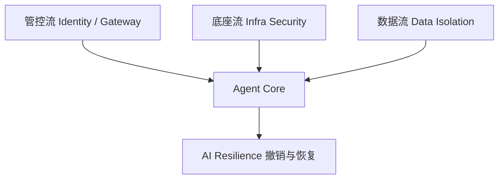

# 智能体治理架构整理

## 1. 顶层蓝图

现场材料的顶层蓝图可以抽象为一个围绕 Agent Core 的四周防护结构：

其中每一层都对应一个治理问题：

- 管控流：谁在发起动作？这个 Agent 是否有身份？权限是否临时、最小、可撤销？
- 底座流：Agent 运行在哪里？容器、模型、插件、依赖、反序列化是否可信？
- 数据流：Agent 读到的数据是否可信？是否包含敏感信息？是否会进入错误上下文？
- 韧性层：Agent 出错后能否定位、止血、撤销、复盘？

## 2. 五条设计原则

### 2.1 身份基建

智能体应被视为第三类身份：

- 不等同于人类账号，因为它没有人类判断力，却能高速执行。
- 不等同于服务账号，因为它任务动态、工具动态、上下文动态。
- 不应长期持有静态高权限。

治理要求：

- Agent 注册与发现；
- Agent 身份生命周期管理；
- JIT（Just-in-Time）任务时授权；
- JEA（Just-Enough-Access）最小必要权限；
- JLA（Just-Long-Enough）最短有效时长；
- Agent Gateway 作为 PEP（Policy Enforcement Point）。

### 2.2 能力隔离

控制流与数据流必须分离：

- 控制流：用户意图、系统策略、审批、授权、执行计划。
- 数据流：文档、网页、邮件、RAG、工具输出、历史记忆。

风险来自二者混淆：

- 文档里的隐藏指令变成控制指令；
- RAG 片段污染 Agent 任务；
- 工具返回内容诱导下一步工具调用；
- 记忆中的旧污染影响新任务。

治理要求：

- 对数据来源打标签；
- 区分可信指令与不可信内容；
- 外部内容只能作为数据，不可直接成为命令；
- 工具执行前重新校验用户意图和策略；
- 高危操作必须有人审或二次确认。

### 2.3 底座防御

AI 基础设施应纳入安全预算：

- 模型仓库；
- 容器运行时；
- 推理框架；
- 插件和 MCP Server；
- 向量数据库、Redis、PostgreSQL；
- CI/CD 与自动代码修改链路。

治理要求：

- 模型签名验证；
- AIBOM / SBOM；
- 供应链审计；
- 反序列化审查；
- 沙箱隔离；
- 禁网、只读、最小 capability；
- 运行时异常检测。

### 2.4 人在环路

HITL 不是弹一个确认框，而是关键操作的责任节点：

- 用户是否理解将要发生什么；
- 审批内容是否可解释；
- 审批是否绑定具体动作、资源和时限；
- 拒绝后是否保证零执行；
- 审批记录是否可审计、可复盘。

治理要求：

- 高危操作二次确认；
- 审批 token 与动作绑定；
- 审批后仍经过 Gate5 / 出向审计；
- 审批拒绝后不执行任何副作用；
- 审批理由和审批人写入审计链。

### 2.5 兜底韧性

企业应接受 Agent 必然犯错：

- 模型会误判；
- Agent 会误执行；
- 用户会误批；
- 数据会被污染；
- 工具会失效；
- 多 Agent 会相互放大错误。

治理要求：

- 动作级审计；
- 文件级行为追踪；
- 精准撤销和补偿操作；
- 事故还原；
- 安全事件分析；
- 策略自动回归测试。

## 3. Substrate 架构

现场材料中的 Substrate 是企业智能体安全基座，可整理为四层。

### 3.1 接入和调度中枢层

职责：

- 智能体接入；
- SDK / API 流量监测；
- 统一网关；
- 技能、插件、工具接入；
- 多智能体纳管；
- 集中式策略分发；
- 全链路日志收口。

关键价值：

- 把分散 Agent 收到统一入口；
- 让安全策略可以集中下发；
- 让所有工具调用有统一审计；
- 让多 Agent 协同不再是黑盒。

### 3.2 安全响应处置层

职责：

- 观察监控；
- 请求拦截；
- 服务降级；
- 安全代答；
- 异常行为处置；
- 策略回滚和调优。

关键价值：

- 不只是判断 allow/deny，还能在风险升高时降级；
- 对业务系统提供可接受的替代响应；
- 将安全从“阻断器”变成“运行时治理器”。

### 3.3 安全能力层

五大能力：

- 安全攻防；
- 行为权限；
- 环境安全；
- 内容安全；
- 审计溯源。

这些能力分别覆盖：

- 输入攻击和模型攻防；
- Agent IAM、动态权限、HITL；
- 插件扫描、沙箱、CVE、基线；
- 内容合规、PII、深度伪造、行业话题；
- 调用链、血缘、事件还原、存证。

### 3.4 安全 tokens 服务层与运营层

安全 tokens 服务层提供：

- 基础通用大模型；
- 行业垂域模型；
- 安全专属大模型；
- 安全运营大模型。

智能化安全运营层提供：

- 告警研判；
- 日志分析；
- 威胁情报；
- 安全知识总结；
- 策略调优。

## 4. 运行阶段安全管控架构

运行时架构可以拆成 6 个关键节点：

1. 用户接入层：APP / WEB / API 进入 AI 安全栏。
2. 智能体应用层：提示词、记忆、知识库、Agent、多 Agent 协同。
3. 模型调用层：模型网关、原始模型、替换模型、微调模型。
4. Agent 身份与权限层：身份注册、权限生成、token 加密流动、管理系统。
5. 插件 / 数据调用层：MCP / Skills 扫描，外部/内部服务网关，应用鉴权。
6. 审计与评估层：AI 内容安全检测、评估报告、全链路日志、事件还原。

对 XA-Guard 来说，现有六 Gate 可以嵌入上述架构：

- Gate1 在用户接入与上下文入口处；
- Gate2 / Gate3 在身份权限和工具授权处；
- Gate4 在内容与数据流处；
- Gate5 在插件、MCP、IO、执行环境处；
- Gate6 在审计与评估层。

## 5. 治理架构的关键落点

面向项目交付，最值得吸收的落点是：

- Agent Gateway：统一入口、统一鉴权、统一策略、统一日志。
- Agent Identity：把 Agent 纳入身份治理，不再共用人类 token 或静态服务账号。
- Capability Token：每次任务生成带范围、时长、资源、动作的能力 token。
- Data Labeling：外部内容、RAG、工具输出、用户指令必须有来源标签。
- Tool Mediation：工具调用必须经过策略判断、风险评估和审计。
- Blast Radius：每个 Agent 的文件、网络、系统、资金、代码权限有明确边界。
- Undo / Resilience：对可撤销动作建立反向操作或补偿流程。
