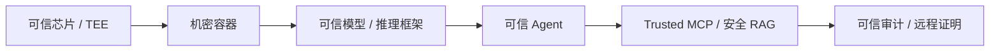

# 数据流与控制流安全

## 1. 为什么数据流成为核心

现场材料反复强调“攻击下沉至数据路径全链”。这是智能体系统区别于传统聊天机器人的关键：

- Agent 会读文档、邮件、网页、工单、Slack、PDF、数据库和 RAG。
- 这些数据会进入上下文窗口，影响模型下一步推理。
- Agent 可能无法区分“用户指令”和“外部内容中的伪指令”。
- 一旦伪指令影响工具调用，就会从内容风险变成执行风险。

因此，数据流安全不是 DLP 的同义词，而是包含：

- 数据来源可信度；
- 数据是否能成为指令；
- 数据是否携带敏感信息；
- 数据是否污染记忆；
- 数据是否影响工具调用；
- 数据是否能被模型或外部服务取走。

## 2. 控制流与数据流分离

控制流包括：

- 用户真实意图；
- 系统开发者指令；
- 企业策略；
- 权限授权；
- 审批结果；
- 执行计划；
- 撤销/补偿规则。

数据流包括：

- 文档；
- 网页；
- RAG 片段；
- 工具返回；
- 邮件和 IM；
- 用户上传文件；
- 历史记忆；
- 外部 API 返回。

安全原则：

```text
数据可以被读取、引用、摘要、检索，但不能未经验证地变成控制指令。
```

工程落地：

- 所有外部内容进入上下文前标记为 untrusted。
- Prompt 模板中明确区分 trusted instruction 与 untrusted data。
- 工具返回结果默认不可发起下一步高危工具调用。
- Agent 执行前从结构化 plan 中提取动作、资源、参数，再交给策略引擎判定。
- 如果动作依赖不可信数据，自动提高风险等级。

## 3. 数据路径攻击的防线

### 3.1 输入入口

防护内容：

- 恶意 PDF；
- Slack / IM 消息；
- 表单字段；
- 网页内容；
- RAG 索引文本；
- 隐形字符；
- emoji 编码；
- 超长字段；
- 注释区隐藏指令。

建议能力：

- Prompt injection 检测；
- 隐形字符和异常 unicode 检测；
- 超长字段截断和摘要隔离；
- 外部内容 spotlighting；
- 来源标签和敏感度标签；
- RAG 入库前扫描。

### 3.2 上下文窗口

风险：

- Agent 把数据当作可信上下文；
- 污染内容与系统指令距离太近；
- 多来源内容混在一个 prompt 中；
- 历史记忆继承旧污染。

建议能力：

- 上下文分区；
- 每段内容保留 provenance；
- 记忆写入前安全审查；
- 高风险来源不写长期记忆；
- 查询时把“指令性文本”降权或隔离。

### 3.3 工具调用

风险：

- 单工具权限合规，组合后形成越权；
- Agent 根据污染上下文触发转账、发信、导出、删除；
- 工具输出再污染下一步；
- MCP / Skills 权限边界不清。

建议能力：

- 工具级 allowlist；
- 参数级策略；
- 组合风险评估；
- 高危操作 HITL；
- 出向数据 DLP；
- 调用链审计；
- 每个工具调用绑定任务 token。

### 3.4 输出与外泄

风险：

- 数据通过模型输出泄露；
- 通过搜索、HTTP、邮件、Slack、外部 API 外泄；
- 通过错误日志、调试日志、trace 外泄；
- 通过生成代码或配置文件泄露凭据。

建议能力：

- 双向内容合规；
- PII / 凭据检测；
- 外发网关；
- 敏感字段脱敏；
- 审计日志分级存储；
- 禁止把敏感上下文发送到非授权模型。

## 4. “数据可用不可见”

现场材料提出可信智能空间的三目标：

- 环境可信；
- 数据安全；
- 行为可控。

其中“数据安全”被表述为数据“可用不可见”。这对政企场景很关键：业务希望模型利用敏感数据完成任务，但安全和合规不允许模型或外部平台直接拿走明文。

可用不可见的几种路线：

- 本地部署模型和向量库；
- TEE / 机密计算；
- 远程证明；
- 数据脱敏和伪匿名；
- 只传摘要或特征；
- PrivLLM 式混淆推理；
- 权限受控的安全 RAG；
- 输出侧防泄漏。

## 5. AICC 可信环境

AICC 页面的核心是“信任物理化 + 透明认证”：

- 硬件可信根：TEE / 机密芯片。
- 全链路度量：模型、容器、推理框架、Agent、MCP、RAG 都可度量。
- 远程证明：调用方可以验证运行环境确实是预期环境。
- 密码学证明：用签名、度量、证书、证明材料形成信任链。

可以映射为：



对 XA-Guard 的启发：

- 当前 gVisor / Docker 是隔离路线；
- 可在未来把 TEE、远程证明、度量启动作为增强路线；
- MCP Server 和模型 runner 可输出环境基线 hash；
- 审计链可以记录环境度量和模型/插件版本。

## 6. PrivLLM 路线

PrivLLM 的目标可以概括为：

```text
让 Agent 能算，但拿不走敏感数据。
```

现场材料展示了三层思想：

1. 离线模型混淆：通过乘性噪声、加性噪声、词表置换等方式改变模型内部对应关系。
2. 在线混淆推理：用户侧把输入混淆后交给非可信推理环境，输出再解混淆。
3. 理论隐私预算：用 RmDP 建模离线和在线阶段的联合隐私预算。

它适合放入项目的“未来增强能力”或“数据安全路线”：

- 当前项目不必实现 PrivLLM；
- 但可以借其表达“可用不可见”的目标；
- 对政企敏感数据场景，PrivLLM / TEE / 本地部署 / 脱敏 RAG 都是可选技术路线；
- 在答辩中可说明 XA-Guard 先做运行时治理，后续可接入隐私推理底座。

## 7. 可信智能体目标函数

现场材料给出的目标函数：

```text
max Intent
s.t. Trust & Security
```

这可以转成产品设计原则：

- 不为了安全完全牺牲任务完成；
- 不为了完成任务无视安全边界；
- 对低风险任务自动执行；
- 对中风险任务降级、脱敏或请求审批；
- 对高风险任务阻断；
- 对可恢复任务允许执行但保留撤销；
- 对不可恢复任务要求更强审批和证据。

风险输入包括：

- 身份伪造；
- 外部内容劫持；
- 记忆污染；
- 工具链污染；
- 敏感信息泄露；
- 过度代理；
- 资源滥用。

这也可以成为 XA-Guard 的统一口号：

> 在安全约束下最大化真实用户意图，而不是在模型能力和安全之间二选一。
