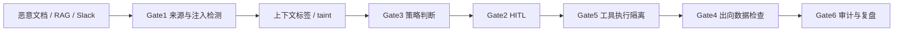

# 与 XA-Guard 的映射

## 1. 总体匹配度

会议材料的核心框架与 XA-Guard 当前方向高度一致：都不把智能体安全简化成 prompt filter，而是强调运行时管控、工具调用、数据流、审计和韧性。

当前 XA-Guard 的六关卡可以解释为：

| XA-Guard Gate | 会议材料对应主题 | 已覆盖能力 |
|---|---|---|
| Gate1 输入攻击识别 | 外部内容劫持、提示注入、RAG 数据路径入口 | prompt injection、spotlighting、规则/模型检测 |
| Gate2 工具风险与 HITL | 高危操作二次确认、人在环路 | red/yellow 工具审批、拒绝零执行 |
| Gate3 策略与权限 | Agent Gateway、JIT/JEA/JLA、动态权限 | 规则策略、角色/资源/动作约束、OPA parity |
| Gate4 内容与数据 | PII、数据防泄漏、内容合规、行业话题 | 内容检测、数据外泄、合规规则 |
| Gate5 执行与沙箱 | 环境安全、MCP/Skills、插件、供应链、blast radius | 沙箱、gVisor 静态、AIBOM、MCP 工具风险 |
| Gate6 审计溯源 | 全链路日志、AI 血缘、法律责任、事件还原 | hash 链、SM2/TSA demo、faithfulness 重算 |

## 2. 需要强化的叙事

当前文档和实现中已经有很多能力，但对外表达仍可更靠近会议材料：

### 2.1 从“六关卡”升级为“Agent Gateway”

现在的 Gate1-Gate6 更像内部实现结构。面向评委和企业客户，可以包装成：

```text
XA-Guard Agent Gateway = 统一接入 + 身份权限 + 数据隔离 + 工具管控 + 沙箱执行 + 审计韧性
```

这样能直接回应现场材料中的：

- Agent Gateway；
- Identity / Gateway；
- MCP 网关授权；
- 安全接入总线；
- 多智能体纳管；
- 全链路日志收口。

### 2.2 从“工具审批”升级为“智能体身份治理”

会议材料强调 Agent 是第三类身份。XA-Guard 可补充表达：

- 每个 Agent 都应有独立 identity；
- Agent 不能无限复用人类 token；
- Agent 能力 token 应包含动作、资源、时长、来源和审批；
- 权限应按任务 JIT 签发；
- 高危权限自动过期；
- 审计记录应包含 Agent identity 与 human principal 的绑定关系。

当前项目已有策略和审计基础，但需要更明确地把“身份”作为一等对象。

### 2.3 从“提示词注入”升级为“数据路径全链防护”

会议材料中的数据路径攻击链可映射到 XA-Guard：



建议补强：

- 在文档中把 taint / provenance 作为数据路径主线；
- 在 bench case 中增加“单工具合规但组合危险”的样例；
- 在审计中记录数据来源如何影响动作；
- 在 RAG/文件/工具输出进入上下文时打标签。

### 2.4 从“审计日志”升级为“责任与韧性”

会议材料提出：

- 法律责任；
- 潜在损失量化；
- AIVSS / NIST AI RMF；
- 动作级撤销；
- UndoAI；
- 安全事件还原。

XA-Guard 现有 Gate6 可以继续扩展为：

- 事件级 timeline；
- 调用链和数据血缘；
- 决策依据；
- 审批记录；
- 环境度量；
- 可撤销动作标记；
- 补偿动作建议；
- 风险评分与潜在影响。

## 3. 与当前 PRD 差距

从会议材料看，当前仓库仍有几类“表达或实现缺口”。

### 3.1 多 Agent 编排治理

现状：

- 当前重点仍是单 Agent 或单次 pipeline；
- 外部 benchmark 覆盖 AgentDojo / InjecAgent，但不是完整多 Agent 编排治理；
- 多 Agent 委托链、责任链、身份传递还没有成为核心对象。

建议：

- 增加“多 Agent 协作网络”章节；
- 定义 Agent-to-Agent 调用审计字段；
- 增加委托链 trace；
- 增加多 Agent 工具组合风险样例；
- 把 AT7 作为未来扩展目标。

### 3.2 Agent 身份资产盘点

现状：

- 有策略、角色、审计、工具风险；
- 但 Agent inventory / identity lifecycle 叙事不足。

建议：

- 增加 Agent 注册表设计；
- 记录 Agent owner、purpose、allowed_tools、allowed_data、risk_level；
- 定义 Agent Acceptable Use Policy；
- 把“数字员工生命周期治理”写入产品架构。

### 3.3 数据“可用不可见”

现状：

- 有 PII / DLP / sandbox / 本地工具；
- 尚未形成完整“可用不可见”路线。

建议：

- 短期：脱敏、来源标签、最小上下文、禁止敏感外发；
- 中期：安全 RAG、内外部服务网关、模型调用分级；
- 长期：TEE、远程证明、PrivLLM 或类似混淆推理。

### 3.4 韧性与撤销

现状：

- Gate6 有审计链；
- 部分 HITL 和 executor 有阻断；
- 但动作级 Undo / 补偿机制尚未成为验收项。

建议：

- 对工具定义 `reversible` / `compensating_action` 元数据；
- 审计每个副作用动作的 undo hint；
- 对文件写入、配置变更、消息发送、资金类操作区分可撤销性；
- 演示“错误操作定位 + 撤销建议”。

### 3.5 法律责任和风险量化

现状：

- 有风险分类和审计；
- 缺少面向董事会/法务的风险金额或责任说明。

建议：

- 在最终报告中增加“风险量化示例”；
- 引入 AIVSS 风险维度：能力、自主性、权限、数据敏感度、可恢复性；
- 对每类 Agent 生成风险评分；
- 说明审计链如何支持事故复盘和责任界定。

## 4. 可直接加入答辩的表述

### 4.1 项目定位

XA-Guard 不是单点提示词过滤器，而是面向政企智能体的运行时安全中台。它通过 Agent Gateway 统一接入智能体、模型和 MCP 工具，在任务执行前、中、后分别完成输入攻击识别、身份权限控制、工具调用审批、数据防泄漏、沙箱隔离和审计溯源。

### 4.2 核心理念

智能体安全的核心不是“让模型永远不犯错”，而是承认 Agent 会犯错，并通过最小权限、控制流/数据流隔离、人在环路、全链路审计和动作级恢复，把错误控制在可承受、可追踪、可纠正的范围内。

### 4.3 与传统安全区别

传统安全主要保护系统边界和接口，智能体安全还要保护“行动边界”：谁让 Agent 做、Agent 为什么做、用什么数据做、调用了哪些工具、是否越权、是否泄密、出错后能否撤销。

### 4.4 价值

XA-Guard 让企业从“AI 能用”走向“AI 敢用”：既不阻碍业务使用多 Agent，也不让 Agent 以黑盒方式直接接触敏感数据、核心系统和生产工具。

## 5. 建议更新到项目材料的关键词

建议在后续 PRD / 答辩 / 架构图中增加或强化以下词：

- Agent Gateway
- Agent Identity / 第三类身份
- JIT / JEA / JLA
- 控制流与数据流隔离
- 数据路径全链攻击
- Capability Token
- Agent Acceptable Use Policy
- Shadow AI 发现与亮路径治理
- AI Resilience / Undo
- AIVSS 风险评分
- AI 血缘与调用链
- 可信智能空间
- 数据可用不可见
