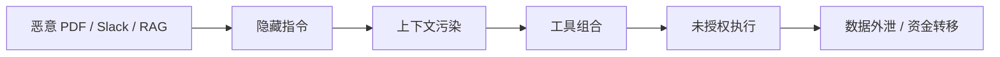

# 落地行动清单

## 1. P0：立刻能补的文档与答辩表达

这些不需要改核心代码，优先用于比赛材料和答辩。

### 1.1 在产品架构中补 Agent Gateway 叙事

要补充：

- XA-Guard 是 Agent Gateway，而不是单点过滤器。
- 六 Gate 是 Agent Gateway 内部的风险控制链。
- Gateway 负责统一接入、统一鉴权、统一策略、统一工具管控、统一审计。

建议落到：

- `docs/planning/产品架构.md`
- `docs/planning/项目总览.md`
- 最终 PPT

### 1.2 增加“第三类身份”章节

要补充：

- 人类身份；
- 静态服务账号；
- Agent 身份；
- Agent 身份为什么需要 JIT/JEA/JLA；
- Agent 身份如何绑定 human principal、owner、task、scope、duration。

建议落到：

- PRD 身份权限要求；
- 产品架构的 Gate2/Gate3；
- 最终答辩图。

### 1.3 增加“数据路径全链攻击”图

建议图：

要表达：

- 单点工具合规不代表组合安全；
- 风险要按能力 × 自主性 × 权限评估；
- XA-Guard 的 Gate1-Gate6 覆盖这个全链。

### 1.4 增加“从能用到敢用”的总结页

三目标：

- 环境可信；
- 数据安全；
- 行为可控。

项目价值：

- 企业不是不知道 AI 有用，而是不敢让 AI 接敏感数据和生产权限；
- XA-Guard 解决的是“敢用”的问题。

## 2. P1：建议近期补的实现或测试

### 2.1 Agent 身份注册表

建议字段：

- `agent_id`
- `agent_name`
- `owner`
- `purpose`
- `risk_level`
- `allowed_tools`
- `allowed_data_classes`
- `max_autonomy`
- `requires_human_approval_for`
- `created_at`
- `expires_at`

价值：

- 支撑“第三类身份”叙事；
- 支撑 Agent inventory；
- 支撑策略引擎按 Agent 身份判定。

### 2.2 Capability Token

建议 token 绑定：

- human principal；
- agent identity；
- task id；
- allowed actions；
- allowed resources；
- allowed data labels；
- expiry；
- approval id；
- policy hash。

价值：

- 实现 JIT/JEA/JLA；
- 防止 Agent 长期持有静态权限；
- 审计时能解释每次调用权限来源。

### 2.3 数据来源和 taint 标签

建议在上下文、工具返回和审计中增加：

- `source_type`
- `source_trust_level`
- `data_labels`
- `taint`
- `provenance`
- `can_influence_control_flow`

价值：

- 支撑控制流/数据流隔离；
- 支撑数据路径攻击检测；
- 支撑 RAG/工具输出污染复盘。

### 2.4 工具组合风险测试

新增 bench 样例方向：

- 单个工具 allow，但组合后导致越权；
- RAG 中隐藏指令诱导调用外发工具；
- 工具 A 返回的内容诱导工具 B 执行；
- Agent 先读文件再发外部 HTTP；
- Agent 先查 PII 再生成邮件；
- 审批拒绝后仍不得执行后续工具。

价值：

- 对应会议材料中的 toxic combination；
- 比单点提示注入更贴近企业风险。

### 2.5 Undo / 补偿元数据

建议为工具定义：

- `side_effect_level`
- `reversible`
- `undo_tool`
- `undo_required_fields`
- `compensation_hint`
- `irreversible_warning`

价值：

- 支撑 AI Resilience；
- 让审计不只是记录，还能恢复；
- 答辩可展示“出错后怎么止血”。

## 3. P2：中期增强路线

### 3.1 多 Agent 编排治理

建议能力：

- Agent-to-Agent 调用审计；
- 委托链 trace；
- 子 Agent 权限继承规则；
- 多 Agent 任务图；
- 多 Agent 冲突检测；
- 多 Agent 终止条件。

对应会议主题：

- AT7 Multi-Agent Orchestration；
- 多 Agent 协作网络；
- 治理难度指数级上升。

### 3.2 Shadow AI 发现和亮路径

建议能力：

- AI 工具访问发现；
- 未登记 Agent 告警；
- 上传敏感数据检测；
- 影子路径风险报告；
- 正式 Agent Gateway 接入指南；
- Agent Acceptable Use Policy。

对应会议主题：

- Shadow AI；
- Agent Gateway 亮路径；
- 员工复制粘贴企业 PI / 代码。

### 3.3 安全运营 Agent

建议演示：

- 告警研判 Agent；
- 合规审查 Agent；
- 自动渗透 Agent；
- 应急处置 Agent；
- 安全策略调优 Agent。

对应会议主题：

- AI for Sec；
- 多智能体能力编排；
- Agent Harness；
- 安全 Skills。

### 3.4 可信环境路线

建议长期路线：

- TEE / 机密计算；
- 远程证明；
- 模型和容器度量；
- Trusted MCP；
- 安全 RAG；
- PrivLLM / 混淆推理调研。

当前项目可先表达为未来扩展，不要误写为已实现。

## 4. 可加入最终交付的材料

建议最终报告加入以下小节：

1. 智能体安全趋势：从内容安全到行动治理。
2. 企业六大挑战：权限、协同、数据、供应链、注入、攻击面。
3. XA-Guard Agent Gateway 架构。
4. 数据路径全链攻击与六 Gate 防护映射。
5. Agent 第三类身份与 JIT/JEA/JLA。
6. 审计、责任量化与 AI Resilience。
7. 与 OWASP AT0-AT8 成熟度的覆盖关系。
8. 当前实现边界与未来增强路线。

## 5. 注意事项

- 本专题来自现场照片整理，不是正式引用源。
- 涉及外部事件、金额、组织报告、法律案例，正式报告引用前必须二次查证。
- 不要把 PrivLLM、TEE、AICC、UndoAI 等写成当前仓库已实现能力；它们目前只能作为启发、路线或对标。
- 不要把“多 Agent 编排治理”写成已完整实现；当前仓库更接近 Agent Gateway / 单 Agent 运行时管控原型。
- 不要为了贴热点弱化现有验收边界；`status.md` 仍应如实写 L3 最终验收 BLOCKED。
